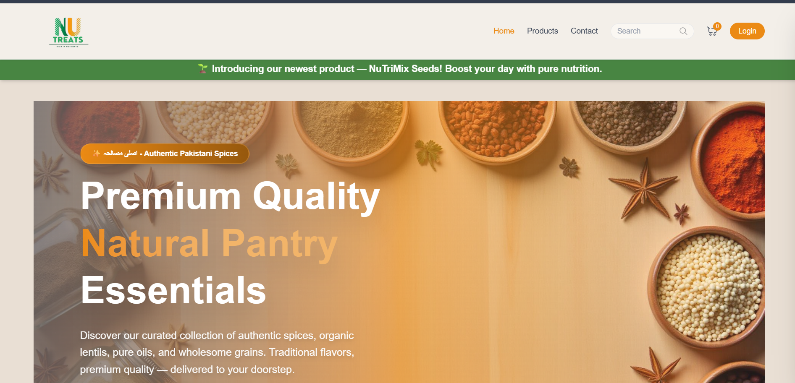
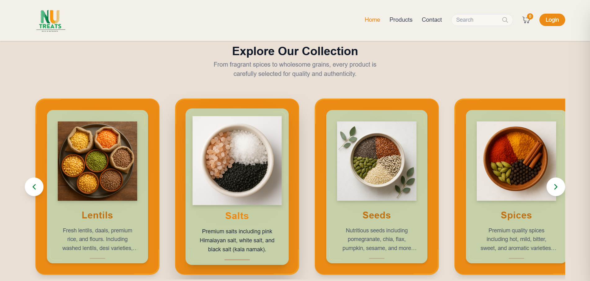
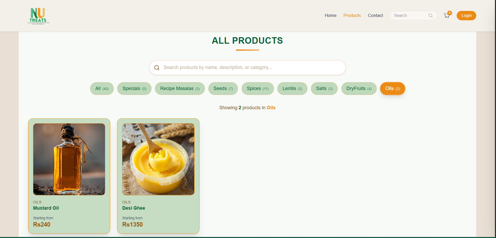
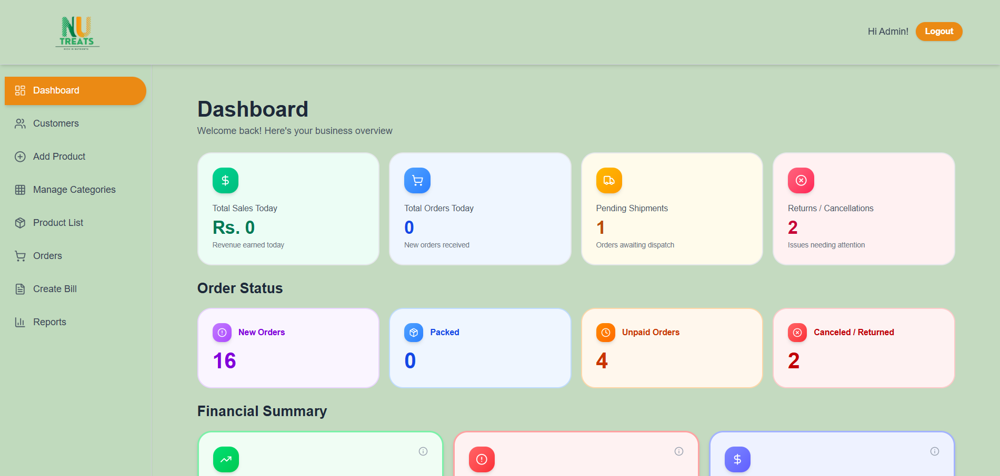
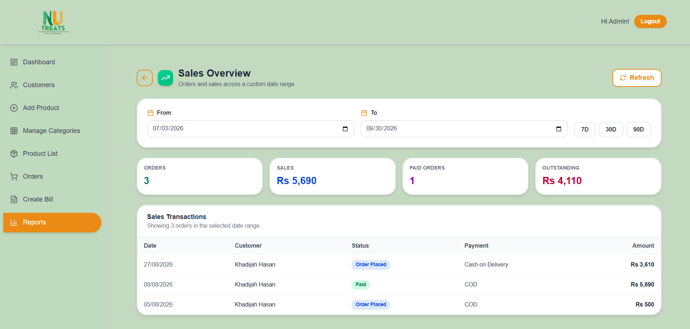

# NuTreats

E-commerce storefront and seller dashboard for natural food products sold in Pakistan. Built with the MERN stack as a client project.

>

## What it does

- **Storefront:** browse products with weight-based variants (e.g. 250g, 500g, 1kg), each with its own price
- **Orders:** customers can order as guests or registered users; sellers can also create manual orders and bills
- **Seller dashboard:** order management, customer tracking, dispatch reminders and product pricing in one place
- **Reports:** sales and customer insights built on MongoDB aggregation queries

## Tech stack

| Layer | Tools |
|---|---|
| Frontend | React |
| Backend | Node.js, Express |
| Database | MongoDB (Atlas) |

